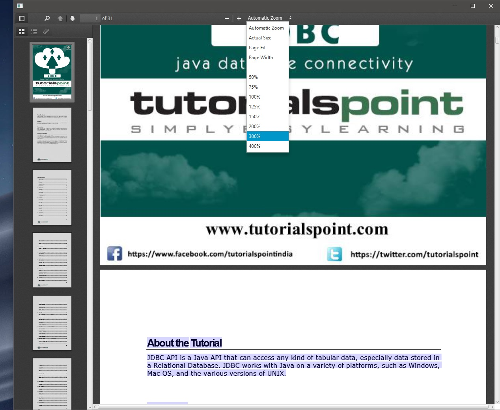

# PDFViewerFX
#### A library for displaying/viewing pdf documents inside your javaFX application
This library is actually a javaFX wrapper for Mozilla's [PDF.js](https://github.com/mozilla/pdf.js/) javascript library, but with this library you don't have to
deal with any javascript code, so you can just use a java object to view pdf documents in javaFX. 

## How to get it?
You can download the jar file from the [releases](https://github.com/Dansoftowner/PDFViewerFX/releases) tab.

## Usage

First, you have to import the necessary class:
```java
import com.dansoftware.pdfdisplayer.PDFDisplayer;
```

```java
PDFDisplayer displayer = new PDFDisplayer();

primaryStage.setScene(new Scene(displayer.toNode())); // to create the javaFX object from the displayer, you have to use the toNode() function 
primaryStage.show();

/*
 * This method creates a FileInputStream and than wraps it into a
 * BufferedInputStream, and then read the data from it.
*/
displayer.displayPdf(new File("path/to/your/file.pdf"));
```

You can also load the pdf from a java.net.URL object:
```java
/*
 * This method calls the URL.openStream() function to get the InputStream then wraps it into a
 * BufferedInputStream, and then read the data from it.
*/
displayer.displayPdf(new URL("https://www.tutorialspoint.com/jdbc/jdbc_tutorial.pdf"));
```

Or you can read the data from any kind of InputStream:
```java
InputStream inputStream = getAnInputStream(); //just for representation
displayer.displayPdf(inputStream);
```

You can use the constructors as well:
```
PDFDisplayer(URL); //reads the data from the URL
PDFDisplayer(File); //reads the data from the File
PDFDisplayer(InputStream) //reads the data from the InputStream 
```

## More operations, tutorials
If you want to deal with some other useful functions from this library, just go to the [wiki](https://github.com/Dansoftowner/PDFViewerFX/wiki) page! 

## Screenshots





